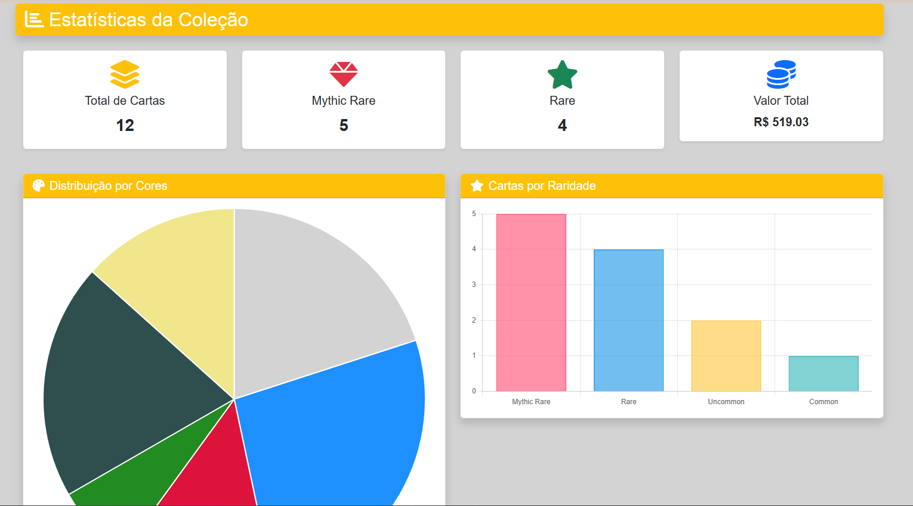
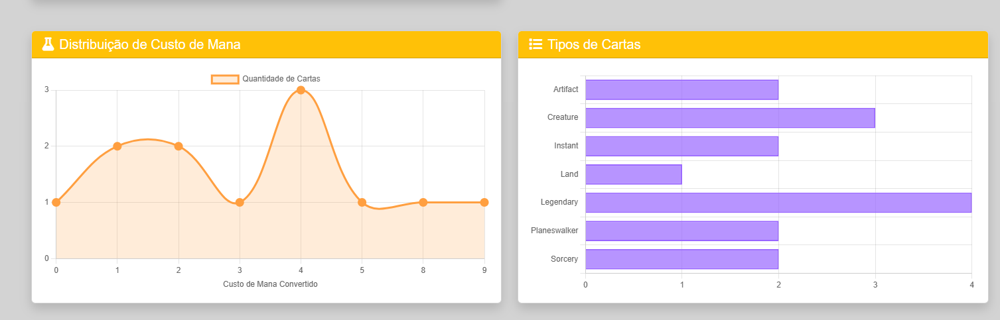
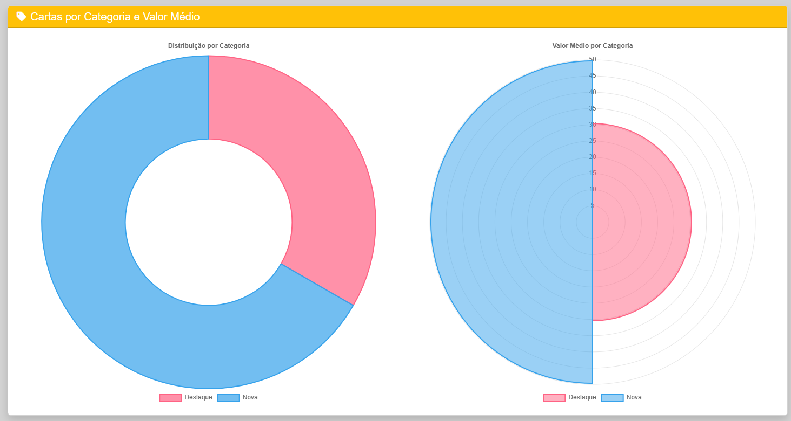
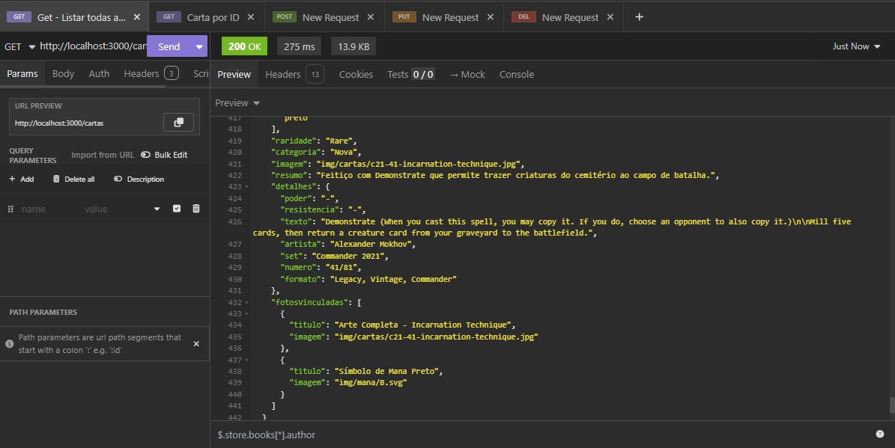
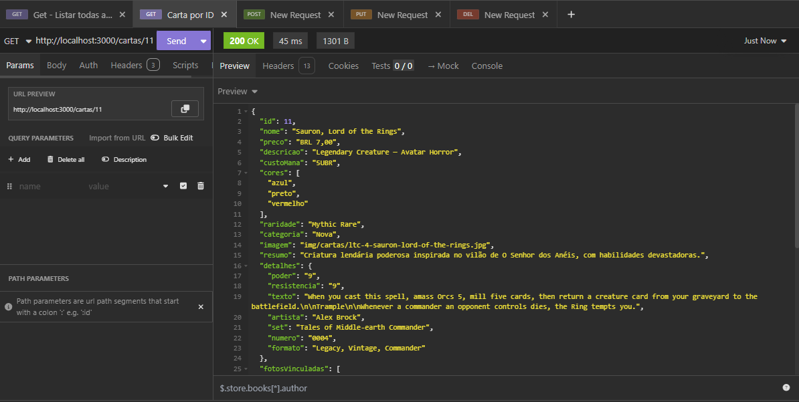
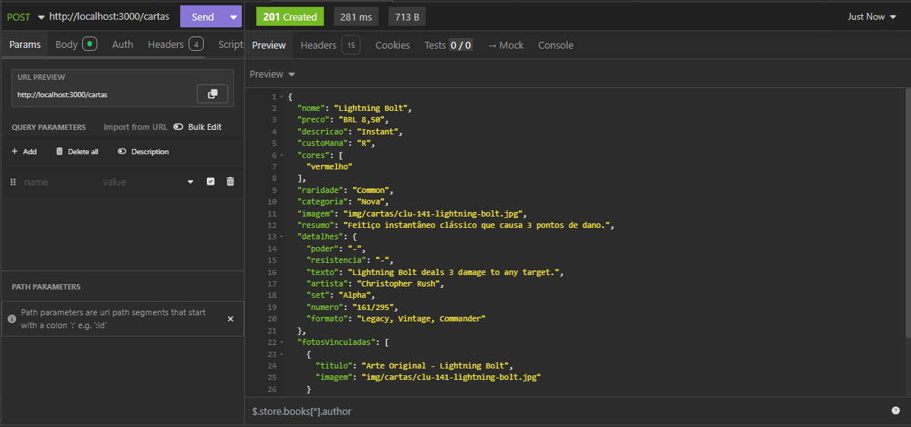
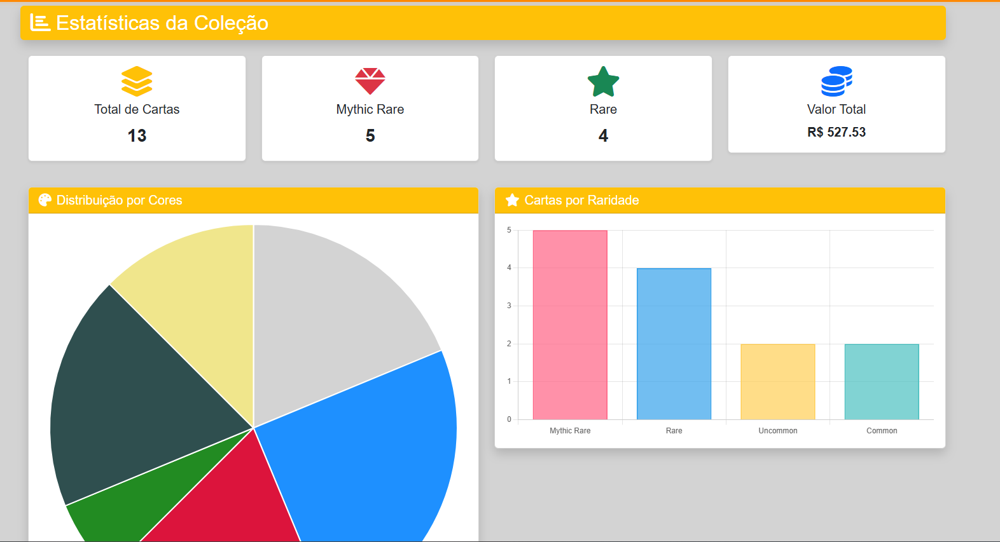
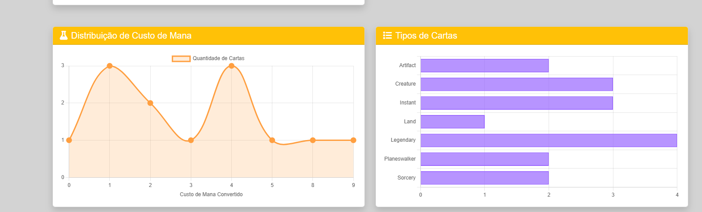
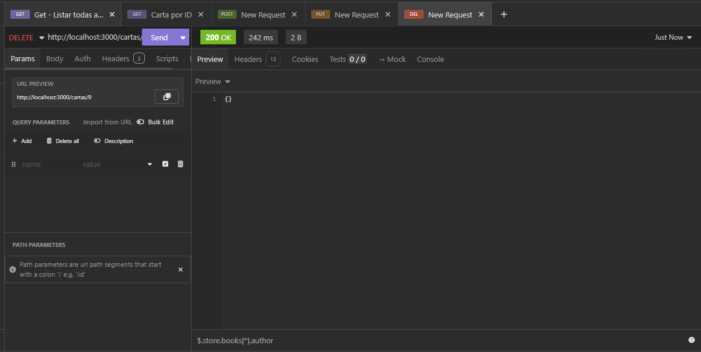

# Trabalho Prático 07 - Semanas 13 e 14

A partir dos dados cadastrados na etapa anterior, vamos trabalhar formas de apresentação que representem de forma clara e interativa as informações do seu projeto. Você poderá usar gráficos (barra, linha, pizza), mapas, calendários ou outras formas de visualização. Seu desafio é entregar uma página Web que organize, processe e exiba os dados de forma compreensível e esteticamente agradável.

Com base nos tipos de projetos escohidos, você deve propor **visualizações que estimulem a interpretação, agrupamento e exibição criativa dos dados**, trabalhando tanto a lógica quanto o design da aplicação.

Sugerimos o uso das seguintes ferramentas acessíveis: [FullCalendar](https://fullcalendar.io/), [Chart.js](https://www.chartjs.org/), [Mapbox](https://docs.mapbox.com/api/), para citar algumas.

## Informações do trabalho

- Nome: Filipe Faria Melo
- Matricula: 730453
- Proposta de projeto escolhida: Galeria Cartas MTG
- Breve descrição sobre seu projeto: Galeria de cartas para Magic: The Gathering, incluindo preço, raridade e informações adicionais sobre cada carta da coleção.

## Implementação da Funcionalidade Dinâmica

Nesta etapa, foi implementada uma **página de estatísticas interativa** utilizando a biblioteca **Chart.js** para apresentação dinâmica dos dados da coleção de cartas Magic.

### Funcionalidades Implementadas:

**1. Cards de Resumo Estatístico:**

- Total de cartas na coleção
- Quantidade de cartas Mythic Rare
- Quantidade de cartas Rare
- Valor total da coleção em reais

**2. Visualizações com Gráficos:**

- **Gráfico de Pizza:** Distribuição das cartas por cores (branco, azul, preto, vermelho, verde, incolor)
- **Gráfico de Barras:** Quantidade de cartas por raridade (Mythic Rare, Rare, Uncommon, Common)
- **Gráfico de Linha:** Distribuição de custo de mana convertido das cartas
- **Gráfico de Barras Horizontais:** Tipos de cartas (Artifact, Creature, Instant, Sorcery, Planeswalker, Land, Legendary)
- **Gráfico Doughnut:** Distribuição de cartas por categoria (Destaque, Nova)
- **Gráfico Polar Area:** Valor médio das cartas por categoria

**3. Carregamento Dinâmico:**

- Todos os dados são carregados dinamicamente via API REST (JSON Server)
- Os gráficos são gerados automaticamente a partir dos dados da coleção
- Interface responsiva e adaptável para diferentes dispositivos

**4. Navegação:**

- Link "Estatísticas" adicionado ao menu principal
- Acesso rápido às visualizações a partir da página inicial

A implementação permite uma análise visual completa da coleção, facilitando a compreensão dos padrões de distribuição de cores, raridade, custos e valores das cartas.

**Print da tela com a implementação**

